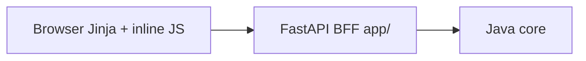

# План рефакторинга PoluPoker BFF

**Цель:** максимальная оптимизация, меньше дублирования, меньше файлов, тот же функционал.

**Как работать с этим файлом:** после ревью дай команду на реализацию по пунктам (например: «делай фазу 0», «фаза 1»). Каждая фаза — отдельный коммит на `test`.

**Статус фаз:**

- [x] Фаза 0 — удаления и rename
- [x] Фаза 1 — общий JS
- [x] Фаза 2 — Python session/auth utils
- [x] Фаза 3 — CSS consolidation
- [ ] Фаза 4 — Jinja partials
- [ ] Фаза 5 — dev-mock (опционально)

---

## Текущая архитектура (кратко)



- Python: ~1.7k LOC (`app/`) — тонкий BFF
- Templates: ~6.7k LOC — почти вся клиентская логика inline
- CSS: ~4k LOC в 9 файлах
- JS: **нет** `static/js/` — дубли toast/fetch/WS в шаблонах

Главный источник «жира» — не количество Python-модулей, а **мёртвые ассеты + клоны шаблонов + copy-paste JS/CSS**.

---

## Принципы (чтобы не сломать прод)

- Сохранить все маршруты и поведение (включая `/dev-lobby`, `/dev-table`, emote shop, Lottie, VIP 17).
- Не сливать `auth` / `lobby` / `tables` / `emote_shop` роутеры в один файл — это ухудшит навигацию при той же сложности.
- Доменный каталог эмодзи оставить в `app/emote_shop.py`; вынести только общие session/wallet/auth хелперы.
- Рефакторить **фазами с проверкой**: home → login → lobby → table → emotes.

---

## Фаза 0 — Быстрые удаления (минус файлы, ноль риска)

**Удалить:**

- `templates/clear_index.html` — мёртвый клон `table.html` (~2.5k LOC), нигде не рендерится
- Неиспользуемые модели: `PasswordRequest` в `app/models.py`
- Пустой `tools/`, placeholder `backlog.txt` (если не нужен команде)
- Неиспользуемые ассеты (подтверждены отсутствием ссылок):
  - long-name card PNGs (`jack_of_*.png`, `queen_of_*.png`, `king_of_*.png`, jokers)
  - `static/dealer.png`, `static/ASnet.png`, `static/poker_chip.png` (используется `poker_chip.svg`)
  - `static/images/lobbyFon.png` (в теме — `lobbyFon2.png` / `lobby_poker.png`)

**Переименовать (1 файл, ясность):**

- `clear_home.html` → `home.html`, обновить `app/main.py`

**Проверка после фазы:** `/`, `/login`, `/lobby`, `/table/{id}`, `/dev-table`

**Ожидаемый эффект:** −1 огромный шаблон, −десятки мёртвых PNG, проще ориентироваться.

---

## Фаза 1 — Общий клиентский JS (максимальный выигрыш по дублям)

Создать **один** файл `static/js/pp-common.js` и подключить в lobby + table (+ login/profile при наличии пересечений).

Вынести из `templates/lobby.html` и `templates/table.html`:

**В common:**

- `showToast` + базовые title maps
- `formatPokerAmount`
- `fetchFreshToken`
- `fetchWithRetry`
- reconnect delay ladder + `scheduleReconnect` helper

**Оставить в странице:**

- page-specific toast titles
- подписки STOMP и handlers событий
- Lottie init / emote panel / shop / table game loop

По умолчанию — **один** `pp-common.js` (второй файл `pp-ws.js` не создавать, пока common не раздуется).

Jinja: добавить общий partial `templates/partials/head_scripts.html` (SockJS/STOMP/Lottie + `pp-common.js?v={{ v }}`), чтобы не копировать CDN-теги.

**Проверка после фазы:** reconnect, toast, rebuy, emote send на table; shop + wallet на lobby

**Ожидаемый эффект:** −300…600 LOC дублей в шаблонах, единый багфикс сети/токенов.

---

## Фаза 2 — Python session/auth утилиты (меньше копипасты в роутерах)

Создать `app/session_utils.py` (не раздувать `services.py`):

- `unauthorized_json()` → всегда `JSONResponse(401, {redirect…})`
- `require_user(request)`
- `sync_user_wallet(request, balance)`
- `refresh_wallet_from_java(request, user) -> int`
- `is_dev_mock_user(user)` (`token == "fake_token"`)
- общий `respond_page_or_json` для паттерна из lobby/tables (`_respond_lobby_result` / `_respond_table_result`)

Подключить в:

- `app/routers/auth.py`
- `app/routers/lobby.py`
- `app/routers/tables.py`
- `app/routers/emote_shop.py`

**Критично:** сейчас часть эндпоинтов в `tables.py` / `lobby.py` / `auth.py` возвращает bare `{"redirect":…}` **без 401** — унифицировать на 401+JSONResponse (фронт уже умеет читать `data.redirect`).

В `app/emote_shop.py` / router:

- удалить неиспользуемый `emotes_dict_json`
- вынести `_apply_mock_purchase(...)` (сейчас 3 почти одинаковых ветки)
- общий `fetch_owned_emote_ids(request, user)` для shop + `tables._resolve_owned_emotes`

**Не делать:** мержить `routers/emote_shop.py` в domain-модуль или в `lobby.py`.

**Проверка после фазы:** 401 redirect, purchase, owned emotes для user 17

**Ожидаемый эффект:** −80…150 LOC Python, единый контракт 401.

---

## Фаза 3 — CSS: объединить оболочки, не убивать страничные скины

### Перенести в `static/css/theme.css`

- Toast (сейчас тройной: `lobby.css`, `poker_table.css`, `table.css`) → база в theme; page-only offsets
- Modal shell: `.pp-modal-overlay`, `.pp-modal-panel`, keyframes → theme
- Единый `--pp-scene-image` (убрать тройной override lobby/table/theme)
- Один chip-класс (`.pp-chip-icon`); page size overrides через CSS vars

### Файлы модалок

- `create_table_modal.css` + `emote_shop_modal.css` → **слить в один** `static/css/modals.css`
  - общая оболочка уже в theme
  - в modals — только контент форм/сетки магазина
- Обновить ссылки в `lobby.html`

### Rebuy dual styles

- Оставить только новый блок `.table-rebuy-*` из `table.css`
- Удалить legacy `.modal-overlay` / `.rebuy-box` из `poker_table.css`
- Упростить классы в разметке `table.html` (убрать dual class names)

### Не сливать агрессивно

- `poker_table.css` + `table.css` оставить двумя слоями (core felt vs page chrome)
- `lobby.css` / `profile.css` / `home.css` / `glass_auth.css` — страничные скины, не трогать кроме общих токенов

**Проверка после фазы:** визуальный регресс модалок / toast / rebuy

**Ожидаемый эффект:** −2 CSS-файла (2 модалки → 1), −дубли toast/rebuy/scene, проще тема.

---

## Фаза 4 — Шаблоны: partials вместо копипасты разметки

Добавить `templates/partials/`:

- `head_assets.html` — fonts + theme.css + version query
- `head_scripts.html` — CDN + pp-common
- `toast_container.html` — единый toast DOM

Подключить в lobby / table / login / profile / home.

**Не дробить** `table.html` на 10 partials за один проход — только повторяющиеся куски. Game-loop оставить в table.

**Проверка после фазы:** те же smoke-страницы (`/`, `/login`, `/lobby`, `/table`, `/dev-table`)

---

## Фаза 5 — Dev-mock консолидация (опционально, низкий приоритет)

Сейчас mock user дублируется в `/dev-lobby` и `/dev-table`. Вынести `build_dev_mock_user(...)` в `session_utils`. Функционал mock сохранить.

---

## Что явно НЕ объединять / НЕ удалять

- Слить все routers в `routes.py` — хуже review/git blame, нулевой выигрыш по рантайму
- Слить `emote_shop.py` (domain) в `services.py` — разные зоны ответственности
- Удалить `poker_table.css` — живая база стола
- Удалить Lottie / sounds / short-code cards — используются
- Выкинуть VIP / mock fallback — нужны для текущего прод/dev flow

---

## Целевая структура после рефакторинга

```
app/
  session_utils.py          # NEW: auth/wallet/401
  emote_shop.py             # catalog (чуть тоньше)
  services.py               # java_request, formatters, templates
  routers/                  # те же 4 роутера, тоньше
static/
  js/pp-common.js           # NEW
  css/theme.css             # + toast + modal shell + tokens
  css/modals.css            # NEW (create+emote shop content)
  css/…                     # без create_table_modal / emote_shop_modal
templates/
  home.html                 # rename from clear_home
  partials/…                # NEW
  # clear_index.html DELETED
```

**Чистая дельта по файлам (ориентир):**

- −1 template (`clear_index`), −2 CSS (модалки → 1), +1 JS, +1 Python util, +partials, −мёртвые PNG
- Суммарно файлов станет меньше за счёт ассетов; исходников «логики» — меньше дублей, чуть больше осознанных shared-модулей

---

## Порядок внедрения

1. Фаза 0 (delete/rename) → smoke
2. Фаза 1 (JS) → сеть/toast/emotes
3. Фаза 2 (Python utils) → 401 / shop / ownership
4. Фаза 3 (CSS) → визуал
5. Фаза 4 (partials) → smoke
6. Фаза 5 (опц.) → dev mocks
7. Коммит(ы) по фазам на `test`, не одним монолитом

Каждая фаза — отдельный коммит, чтобы легко откатить.
